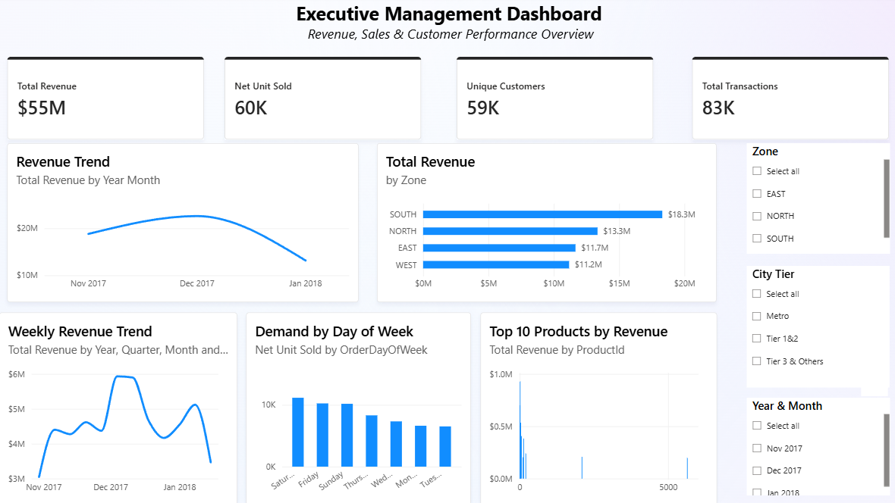
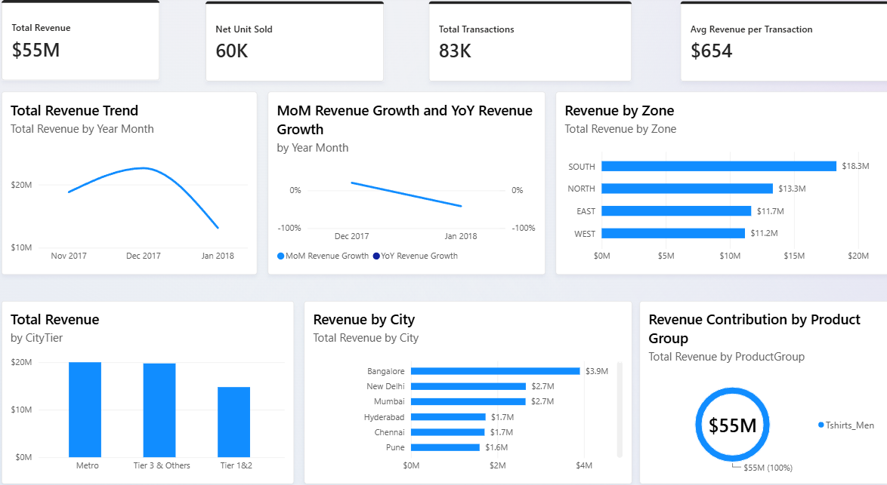
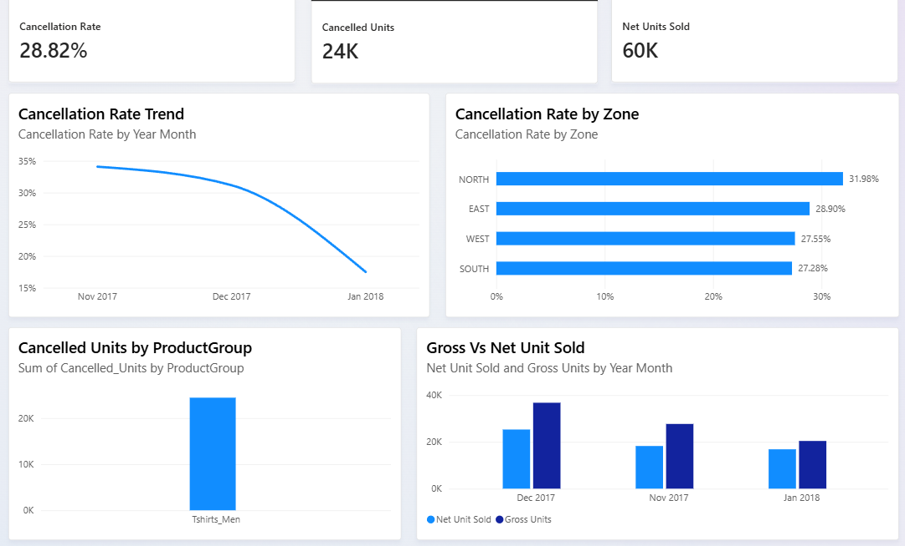

# Retail Analytics Dashboard | Power BI

This is a Data Analyst fresher portfolio project built using Microsoft Power BI.

The project is a Retail Analytics Transformation built in Microsoft Power BI. The objective was to combine fragmented retail transaction and lookup data into a unified analytical model and interactive dashboard for monitoring revenue, sales volume, cancellations, customer activity, product performance, and geographic performance.

---

## 1. PROJECT OVERVIEW

This project focuses on:

- Revenue performance  
- Sales and net unit performance  
- Cancellation analysis  
- Customer activity  
- Product performance  
- Geographic performance  
- City-tier analysis  
- Demand by day and time period  

It demonstrates an end-to-end Data Analyst workflow from raw data preparation to business insights and recommendations.

---

## 2. PROJECT WORKFLOW
   Raw Data
→
Power Query
(Data Cleaning & Transformation)
→
Data Model
(Relationships & Validation)
→
DAX
(KPIs & Measures)
→
Power BI
(Interactive Dashboards)
→
Business Insights
→
Business Recommendations

---

## 3. DATA SOURCES

| File | Description | Key Fields | Notes |
|------|-------------|------------|-------|
| **Mod3_Raw_Sales_v0.1.xlsx** | Main sales transaction/fact data | OrderDate, UserId, ProductId, PinCode, Revenue, Units, Cancelled_Units | 83,374 transactions, Date range: 01 Nov 2017 – 20 Jan 2018 |
| **Mod3_Raw_ProductMap_v0.1.csv** | Product mapping | ProductId, ProductGroup | Lookup table |
| **Mod3_Raw_CityTier_v0.1.csv** | City-level segmentation | City, CityTier | Lookup table |
| **Mod3_Raw_PinCodeGeo_v0.1.xlsx** | Geographic mapping | PinCode, City, Zone | Lookup table |

---

## 4. DATA PREPARATION

Performed in **Power Query**:

- Corrected data types  
- Checked missing values  
- Checked duplicate records  
- Connected sales data with Product Mapping  
- Connected sales data with geographic lookup tables  
- Validated key matching between Sales ProductId and Product Mapping ProductId  
- Checked PinCode and city relationships  
- Reviewed CityTier mapping  
- Created month fields  
- Created day-of-week fields  
- Created Net Units field  

**Net Units = Units - Cancelled_Units**

Unresolved geographic values were kept visible rather than assigning guessed values.

---

## 5. DATA MODEL

- **Sales Transactions** → Main fact table  
- **Product Mapping** → Lookup/dimension table  
- **PinCode-Geo** → Geographic lookup/dimension table  
- **CityTier** → City-level segmentation  

The model follows a **star-schema-style analytical structure**.

---

## 6. MAIN RELATIONSHIPS

- Sales Transactions[ProductId] → Product Mapping[ProductId]  
- Sales Transactions[PinCode] → PinCode-Geo[PinCode]  
- PinCode-Geo[City] → CityTier[City]  

---

## 7. DAX & KPI DEVELOPMENT

DAX was used to create analytical measures and KPIs:

- Total Revenue  
- Gross Units  
- Net Units  
- Cancelled Units  
- Cancellation Rate  
- Unique Customers  
- Average Revenue per Transaction  
- Revenue analysis  
- Cancellation analysis  
- Customer analysis  
- Time-based analysis  
- Geographic performance analysis  

---

## 8. KEY DEFINITIONS

### Total Revenue  
Total reported revenue from the sales transaction data.

### Gross Units  
Total units before cancelled units are deducted.

### Net Units  
Units remaining after cancelled units are deducted.  
**Net Units = Units - Cancelled_Units**

### Cancelled Units  
Total cancelled units recorded in the transaction data.

### Cancellation Rate  
Cancelled units represented as a percentage of gross units.  
**Cancellation Rate = Cancelled Units / Gross Units**

### Unique Customers  
Number of unique customers based on UserId.

### Average Revenue per Transaction  
Average reported revenue generated per transaction.

---

## 9. KEY KPI SUMMARY

| KPI | Value |
|---|---:|
| Total Revenue | 54.51M |
| Gross Units | 84,760 |
| Net Units | 60,328 |
| Cancelled Units | 24,432 |
| Cancellation Rate | 28.82% |
| Unique Customers | 59,164 |
| Average Revenue per Transaction | 653.84 |

*Note: Dashboard displays rounded values (e.g., $55M, 60K, 83K). README uses verified underlying values.*

---

## 10. DASHBOARD PAGES

### Revenue Performance
- Total revenue trend  
- Revenue by zone, city, city tier  
- Revenue contribution by product group  
- MoM and YoY revenue growth  

### Cancellation & Loss Analysis
- Cancellation rate and cancelled units  
- Cancellation rate trend  
- Cancellation rate by zone  
- Cancelled units by product group  
- Gross vs Net Units  

### Customer & Demand Analysis
- Unique customers  
- Customer trend by month  
- Weekly demand trend  
- Weekday vs weekend demand  
- Customers by city tier  

### Product Performance
- Revenue by Product ID  
- Net Units by Product ID  
- Top and bottom products  
- Cancellation rate  
- Revenue by zone and city tier  

*Note: Product ID-level analysis is more appropriate since Product Mapping contains only one Product Group: Tshirts_Men.*

### Executive Management Dashboard
- High-level KPIs  
- Revenue trend  
- Revenue by zone  
- Weekly revenue trend  
- Demand by day of week  
- Top 10 products by revenue  
- Interactive filters for Zone, City Tier, Year & Month  

---

## 11. DASHBOARD PREVIEW

# Dashboard Preview

  
*Executive-level KPIs and trends.*

  
*Revenue trends and breakdowns.*

  
*Cancellation rates and unit analysis.*

---

## 12. KEY BUSINESS INSIGHTS

### Verified Findings:
- **South Has the Highest Revenue** → ~18.31M  
- **North Has the Highest Cancellation Rate** → 31.98%  
- **December Is the Highest Complete Month** → ~22.59M  
- **Saturday Has the Highest Day-of-Week Revenue** → ~9.55M  
- **Product-Level Analysis Is More Appropriate** → Only one Product Group exists  
- **January 2018 Is a Partial Month** → Dataset ends on 20 Jan 2018  

**Summary Table:**

| Insight | Value |
|---------|-------|
| Highest Revenue Zone | South (18.31M) |
| Highest Cancellation Rate Zone | North (31.98%) |
| Highest Month | December (22.59M) |
| Highest Day-of-Week Revenue | Saturday (9.55M) |
| Product Group | Only Tshirts_Men |
| January 2018 | Partial month |

---

## 13. BUSINESS RECOMMENDATIONS

- Investigate cancellation drivers in North  
- Review cancellation patterns across Product ID, date, city, and zone  
- Plan inventory and operational coverage around weekend demand  
- Perform deeper analysis of South zone  
- Improve product taxonomy for better group-level analysis  
- Correct geographic lookup values before relying on city-tier analysis  

---

## 14. DATA QUALITY & LIMITATIONS

- Product Mapping contains only one Product Group: Tshirts_Men  
- Revenue has no explicit currency field (values reported in source units)  
- Dataset ends on 20 Jan 2018 (January is partial month)  
- CityTier has one missing CityTier value  
- 12 sales rows resolve to city records without a CityTier  
- PinCode-Geo contains malformed city value ", India"  
- Cancelled revenue cannot be reliably calculated (no separate cancelled-revenue field)  
- Unresolved geographic values were kept visible rather than assigning guessed values  

---

## 15. TECHNICAL SKILLS

### Power BI
- Interactive Dashboard Development  
- KPI Development  
- Data Visualization  
- Interactive Filters  
- Time-Based Analysis  
- Geographic Analysis  

### Power Query
- Data Cleaning & Transformation  
- Data Type Correction  
- Missing Value & Duplicate Checking  
- Lookup Table Integration  
- Data Validation  

### DAX
- Measure Creation  
- KPI Development  
- Revenue, Cancellation, Time-Based Analysis  

### Data Modeling
- Fact Table Design  
- Lookup/Dimension Tables  
- Relationship Creation  
- Key Validation  
- Star-Schema Modeling  

### Business Analysis
- Revenue, Cancellation, Customer, Product, Geographic, Demand Analysis  
- Business Insights & Recommendations  

---
## Author
Bhoomika Jakhar
Data Analyst | SQL | Excel | Power BI

